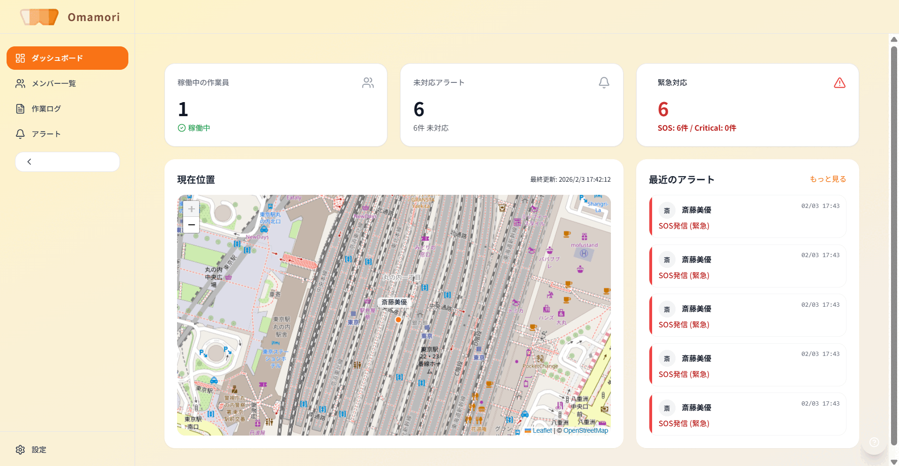
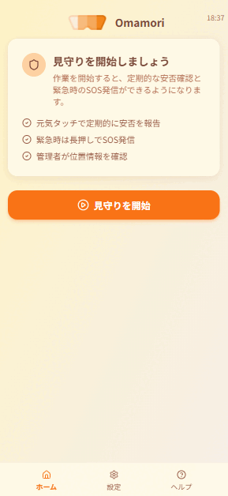
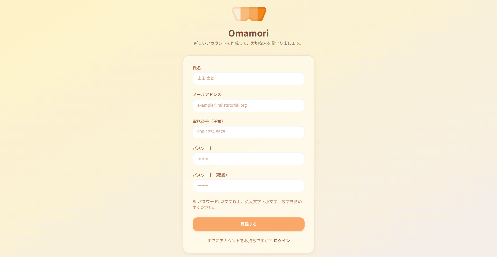
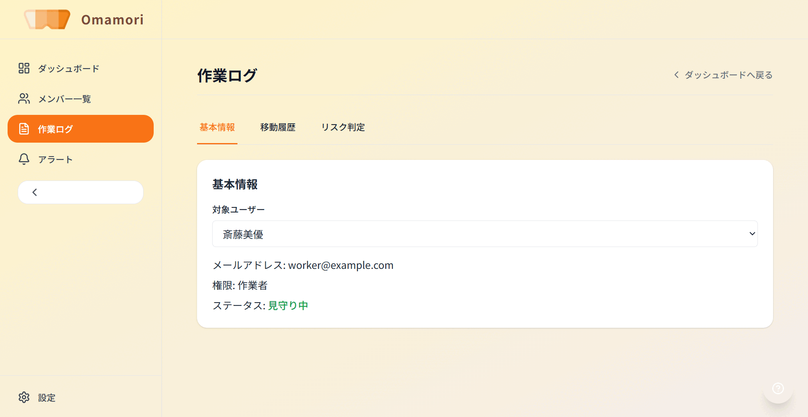
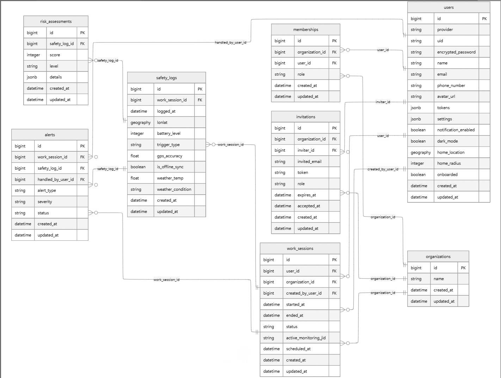

## サービスの概要
「Omamori」は高齢者など単独で作業している方を見守るアプリケーションです

異常を検知するとアラートが発生し、どこで作業しているのかをマップから確認できます

## サービスのURL
https://omamoriworker.com/

※ 本プロジェクトは現在、プロトタイプ検証フェーズにあります。 現在、モバイルブラウザにおける認証持続性の向上に向けたアップデートを順次実施しております

## サービスへの思い

かつて私の祖父は、真夏の農作業中に熱中症で意識を失いました。その時はたまたま通りがかった近所の人が発見し、一命を取り留めましたが、もし発見が30分遅れていたら結果は違っていたかもしれません。

地方ではこうした単独で作業している高齢者が多く、意識を失った方は自らSOSを発信することができません。 私はこの経験から、「ユーザーが操作しなくても、異常があればシステムが自律的に外部へ助けを求める仕組み」によって事故を防ぎたいと思い、本アプリケーションを開発しました。

## アプリケーションのイメージ

| 1. 管理者ダッシュボード | 2. Worker アプリ |
| :--- | :--- |
|  |  |
| リアルタイムに作業者の位置とステータスを把握。異常時にはアラートが表示されます。 | 作業開始から「見守り」を有効化。SOS発信や異常が発生したときの安否確認（元気タッチ）が可能です。 |

<b>その他の機能</b>

| 3. ログイン・認証 | 4. 作業ログ・履歴 |
| :--- | :--- |
|  |  |
| Devise Token Authを用いた認証です。新規登録、ログイン、パスワードリセット機能 | 過去の移動履歴を地図とデータで確認できます |

| 分類 | 機能 | 概要 |
| :--- | :--- | :--- |
| **組織設定** | 組織情報の編集 | 組織名などの基本情報を更新 |
| **招待管理** | 招待中ユーザーの一覧/削除 | 招待の状況確認と管理 |
| **メンバー管理** | 権限変更・メンバー削除・見守り開始/停止 | 管理者/作業者の権限切替や削除 |
| **アラート管理** | 詳細表示/既読・未読/削除 | アラートの確認とステータス更新 |
| **作業ログ** | タブ切替（基本情報/安全日誌/危険予知） | 作業内容・安全ログ・リスク判定の閲覧 |
| **Worker設定** | 拠点（ホーム）位置の登録/変更 | 位置情報の基準地点を設定 |
| **Worker操作** | 元気タッチの取り消し・SOS送信 | 一定時間内の取り消し機能 |

## アーキテクチャ図

※ 点線の部分はこれ以降に実装する

## 業務フロー図

大きいので折りたたんでいます

    

## ER図

ER図の設計意図

### users が複数の外部キーを持つ理由
users テーブルは以下の役割を担います。

- 作業者（work_sessions.user_id）
- セッション作成者（work_sessions.created_by_user_id）
- 招待者（invitations.inviter_id）
- アラート対応者（alerts.handled_by_user_id）

役割が異なるため、意味ごとに外部キーを分けています

---

### アラートと安全ログの関係
alerts は必ず work_session に紐づきますが、
タイムアウトや手動発報など、直接の safety_log が存在しないケースを考慮し、
safety_log_id は Optional としています

---

### 作業セッション中心の設計
本システムでは work_sessions を業務の中心エンティティとし、
safety_logs → risk_assessments → alerts が派生する構造としています。

## 技術スタック

### フロントエンド

| 分類 | 名称 (バージョン) | 説明 |
| :--- | :--- | :--- |
| **フレームワーク** | Next.js (14.2.33) | Reactベースのフレームワーク (App Router) |
| **言語** | TypeScript (5.9.3) | 静的型付けによるコード品質の担保 |
| **ライブラリ** | React (18.3.1) | UI構築のためのライブラリ |
| **スタイリング** | Tailwind CSS (3.4.19) | CSSフレームワーク |
| **地図** | Leaflet (1.9.4) | 地図ライブラリ |
| | React Leaflet (4.2.1) | LeafletをReactコンポーネントとして扱うためのラッパー |
| **アイコン** | Lucide React (0.562.0) | 軽量アイコンセット |
| **テスト** | Jest (30.2.0) | ユニットテスト・ロジックの検証 |
| | Playwright (1.57.0) | E2Eテストによるブラウザ動作の検証 |
| **リント/フォーマット** | ESLint (8.57.1) | コードの静的解析ツール |
| | Prettier (3.3.3) | コードフォーマッター |

---

### バックエンド

| 分類 | 名称 (バージョン) | 説明 |
| :--- | :--- | :--- |
| **フレームワーク** | Ruby on Rails (7.2.3) | APIモードで使用。高速な開発サイクルを実現 |
| **言語** | Ruby (3.2.10) | バックエンド開発言語 |
| **データベース** | PostgreSQL (15) | リレーショナルデータベース |
| **拡張機能** | PostGIS (3.4) | 空間データ（位置情報）を扱うための拡張機能 |
| | activerecord-postgis-adapter | RailsからPostGISを扱うためのアダプター |
| **認証** | Devise Token Auth (1.2.6) | トークンベースの認証（SPA向け） |
| **HTTPクライアント** | Faraday (2.14.0) | 外部API連携用のHTTPクライアント |
| **メール** | Resend (1.0.0) | トランザクションメール配信サービス |
| **ページネーション** | Kaminari (1.2.2) | ページネーション機能の提供 |
| **テスト** | RSpec (7.1.1) | テストフレームワーク |
| **セキュリティ** | Brakeman (7.1.1) | 脆弱性検出のための静的解析ツール |
| | Bundler-audit (0.9.2) | Gemの脆弱性チェックツール |
| **品質管理** | RuboCop (1.72.1) | Rubyコードの静的解析・フォーマッター |

---

### インフラ・環境構成

| 分類 | 名称（バージョン） | 説明 |
| :--- | :--- | :--- |
| **開発環境** | Docker & Docker Compose | コンテナ化による統一された開発環境の構築 |
| | Puma | Rails組み込みのWebサーバー |
| | PostgreSQL (15) | 開発用データベース |
| | PostGIS (3.4) | 空間データ処理対応 |
| **本番環境** | Render | バックエンド（Rails API）のホスティング |
| | Vercel | フロントエンド（Next.js）のホスティング |
| | Neon | PostgreSQL データベース（クラウド） |

---

### 認証・認可

| 分類 | 名称（バージョン） | 説明 |
| :--- | :--- | :--- |
| **認証方式** | Devise Token Auth (1.2.6) | トークンベースの認証（SPA/Mobile向け） |
| **セッション管理** | Cookie (secure, HttpOnly) | CSRF 対策と認証状態の保持 |
| **権限管理** | Role-based Access Control (RBAC) | admin / worker ロール による機能制限 |

---

### CI/CD

| 分類 | 名称 | 説明 |
| :--- | :--- | :--- |
| **フロントエンド** | GitHub Actions | ESLint / Prettier による自動チェック、Playwright E2E テスト実行 |
| **バックエンド** | GitHub Actions | RSpec テスト実行、RuboCop / Brakeman による静的解析 |
| **デプロイ** | GitHub Actions / 手動デプロイ | テスト成功時に自動ビルド・デプロイを予定 |

## 今後の展望

### 1. 技術的なパフォーマンス改善
- **非同期処理の導入 (Sidekiq + Redis)**
    - 現在は同期的に行っている「重い空間計算処理」や「ログ集計」をバックグラウンドジョブに移行し、APIのレスポンス速度を向上させます。
- **リアルタイム通信の強化**
    - 現在はポーリングで定期的に情報を取得しているため、Action Cable (WebSocket) を導入し、アラート発生時に管理画面をリロードしなくても即座に警告が表示される仕組みを構築します。

### 2. 見守り機能の強化
- **プッシュ通知・外部連携**
    - 現在のブラウザ上のアラートに加え、Web Push APIを活用し、管理者が画面を見ていない時でも緊急事態に気づける通知システムを実装します。

### 3. モバイル対応の深化
- **ネイティブアプリ化 (React Native)**
    - 現在はプロトタイプのためWeb技術で実装しているが、実用段階ではNative化が必須であるためReact Nativeを用いたモバイルアプリ化を目指します。
- **オフライン動作のサポート**
    - 電波の届きにくい山間部の農地でもログが消失しないよう、ローカルストレージに一時保存し、オンライン復帰時にまとめて同期する機能を実装します。

### 4. 運用の安全性・品質担保
- **エラー監視とオブザーバビリティ (Sentry)**
    - フロントエンド・バックエンド双方にSentryを導入し、ユーザーからの報告を待たずにクラッシュや予期せぬエラーを検知・修正できる体制を整えます
